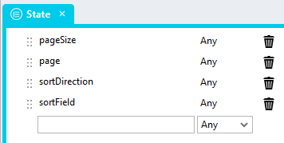
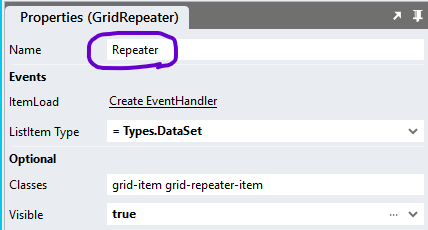

# Repeater Child DataGrid <!-- omit in toc -->

This module provides for the display of a *DataGrid* control inside of a *Repeater* control to display a nested data, commonly also referred to as a ChildGrid. 

https://github.com/user-attachments/assets/476319a7-dc6b-410f-b388-e90917d2166f

# Basic Setup Overview

1. Add the [RepeaterChildDataGrid](#repeaterchilddatagrid-global-script) script
2. Add the [types](#types)
3. Add the [controls](#page) to your Page
4. Initialise the view in the [Page.Load](#pageload) event handler
5. Add the [CSS](#css) to your Embedded files and reference them in the application  header property

Check out the [Client-Side Repeater DataGrid](https://github.com/stadium-software/repeater-datagrid-client-side) repo to find out how to add some more advanced features

# Version
1.0

# Setup

## Application Setup
1. Check the *Enable Style Sheet* checkbox in the application properties

## RepeaterChildDataGrid Global Script
This is the main script necessary to create the tabular view of the Repeater

1. Create a Global Script called "RepeaterChildDataGrid"
2. Add the input parameters below to the Global Script
   1. Data
   2. Columns
   3. State
   4. PagingType
   5. InitialiseExpanded
   6. ExpandMultiple
   7. RepeaterControlName
   8. DataGridControlName
   9. ContainerClass
   10. DataGridDataItem
3. Drag a *JavaScript* action into the script
4. Add the Javascript below into the JavaScript code property
```javascript
/* Stadium Script v1.0 https://github.com/stadium-software/repeater-childgrids */
let scope = this;
let repeaterData = ~.Parameters.Input.Data || [];
let cols = ~.Parameters.Input.Columns || [];
let state = ~.Parameters.Input.State || {};
let pageSize = parseInt(state.pageSize);
let sortField = state.sortField;
let sortDirection = state.sortDirection;
let pagingType = ~.Parameters.Input.PagingType || "default";
let expandAll = ~.Parameters.Input.InitialiseExpanded || false;
let expandMultiple = ~.Parameters.Input.ExpandMultiple;
let dgDataItem = ~.Parameters.Input.DataGridDataItem || "children";
if (expandMultiple === "false" || expandMultiple === false) {
    expandAll = false;
} else {
    expandMultiple = true;
}
let page = state.page;
let pagers = 10;
let totalRecords = repeaterData.length;
let repeaterName = ~.Parameters.Input.RepeaterControlName;
if (!repeaterName) {
     console.error("The name of the Repeater control from the Stadium Designer is necessary to assign the data");
     return false;
}
let childDataGridName = ~.Parameters.Input.DataGridControlName;
if (!childDataGridName) {
     console.error("The name of the DataGrid control inside the Repeater control in the Stadium Designer is necessary to assign the data");
     return false;
}
if (isNaN(page)) page = 1;
let totalPages = Math.ceil(totalRecords / pageSize);
if (page > totalPages) page = 1;
let containerClass = ~.Parameters.Input.ContainerClass;
if (!containerClass) {
     console.error("The ContainerClass parameter is required");
     return false;
}
let container = document.querySelectorAll("." + containerClass);
if (container.length == 0) {
    console.error("The class '" + containerClass + "' is not assigned to any container");
    return false;
} else if (container.length > 1) {
    console.error("The class '" + containerClass + "' is assigned to multiple containers");
    return false;
}
container = container[0];
container.classList.add("stadium-client-side-dg-repeater", "parent-grid-repeater-container");
let grid = container.querySelectorAll(".grid-layout");
if (grid.length == 0) {
    console.error("The container '" + containerClass + "' must contain a Grid control");
    return false;
} else if (grid.length > 1) {
    console.error("The container '" + containerClass + "' must contain only one Grid control");
    return false;
}
grid = grid[0];
grid.classList.add("parent-grid");
let contID = container.id;
let cellsPerRow = cols.length;
if (document.getElementById(contID + "_stylesheet")) document.getElementById(contID + "_stylesheet").remove();
initRepeaterGrid();
/*----------------------------------------------------------------------------------------------*/
async function initRepeaterGrid() {
    attachStyling();
    addHeaders(cols);
    addPaging();
    if (sortField && sortDirection) {
        repeaterData = sort(repeaterData, sortField, sortDirection);
    }
    await setRepeaterData(repeaterData);
}
async function setRepeaterData(d) {
    let first = (page - 1) * pageSize;
    let pageData = d.slice(first, first + pageSize);
    await assignData(pageData);
    await assignChildData(pageData);
    writeCookie();
    await prepareRepeaterCells();
    await handleGridExpansions(expandAll);
}
async function assignData(pd) {
    scope[`${repeaterName}List`] = pd;
}
async function assignChildData(pd) {
    for (let i = 0; i < pd.length; i++) {
        let childDGName = childDataGridName + "-item" + i;
        scope[repeaterName][childDGName + "Data"] = pd[i][dgDataItem];
        scope[repeaterName][childDGName + "SearchTerm"] = null;
    }
}
function writeCookie() {
    let value = JSON.stringify({
        "pageSize": pageSize,
        "page": page,
        "sortDirection": sortDirection,
        "sortField": sortField
    });
    let options = {
        secure: true,
        samesite: "strict",
        domain: window.location.hostname,
    };
    let updatedCookie = encodeURIComponent(contID) + "=" + encodeURIComponent(value);
    for (let optionKey in options) {
        updatedCookie += "; " + optionKey;
        let optionValue = options[optionKey];
        if (optionValue !== true) {
            updatedCookie += "=" + optionValue;
        }
    }
    document.cookie = updatedCookie;
}
function addHeaders(c) { 
    let headers = container.querySelectorAll(".repeater-header");
    for (let i = 0; i < headers.length; i++) {
        headers[i].remove();
    }
    for (let i = c.length-1; i > -1; i--) {
        let gItem = createTag("div", ["grid-item", "repeater-header", "odd-row"]);
        let el = createTag("div"), inner;
        if (c[i].header && c[i]?.sortable !== false && c[i]?.sortable !== "false") {
            el = createTag("div", ["control-container", "link-container"], [{name: "field", value:c[i].name}]);
            inner = createTag("a", ["btn", "btn-lg", "btn-link"], [{name: "rel", value:"noopener noreferrer"}], c[i].header);
            inner.addEventListener("click", handleSort);
            el.appendChild(inner);
        } else if (c[i].header) { 
            el = createTag("div", ["control-container", "label-container"], [{name: "field", value:c[i].name}]);
            inner = createTag("span", [], [], c[i].header);
            el.appendChild(inner);
        }
        if (c[i]?.visible == false || c[i]?.visible == 'false') el.classList.add("visually-hidden");
        if (c[i].name == sortField && sortDirection.toLowerCase() == "asc") el.classList.add("dg-asc-sorting");
        if (c[i].name == sortField && sortDirection.toLowerCase() == "desc") el.classList.add("dg-desc-sorting");
        gItem.appendChild(el);
        grid.insertBefore(gItem, grid.firstChild);
    }
    addExpander(null, "even-row");
}
function addPaging() { 
    if (container.querySelector(".paging")) container.querySelector(".paging").remove();
    let pagingContainer = createTag("div", ["layout-control", "container-layout", "paging", "inline-block-element", "data-grid-container"]);
    if (pagingType.toLowerCase() == "classic") {
        let pagingButtonsContainer = createTag("ul", ["pagination"]);
        let pagingButtons = addClassicPagingButtons(pagingButtonsContainer, page);
        pagingContainer.appendChild(pagingButtons);
    } else {
        let prevButtonContainer = createTag("div", ["control-container", "button-container", "previous-button"]);
        let prevButton = createTag("div", ["btn", "btn-lg", "btn-default"], [], "<<");
        let nextButtonContainer = createTag("div", ["control-container", "button-container", "next-button"]);
        let nextButton = createTag("div", ["btn", "btn-lg", "btn-default"], [], ">>");
        let goInputContainer = createTag("div", ["control-container", "text-box-container", "specific-page"]);
        let goInput = createTag("input", ["form-control", "error-border", "text-box-input", "specific-page-input"], [{name: "type", value: "text"}]);
        let goButtonContainer = createTag("div", ["control-container", "button-container", "specific-page-go"]);
        let goButton = createTag("div", ["btn", "btn-lg", "btn-default"], [], "Go");
        let pageInfoContainer = createTag("div", ["control-container", "label-container", "page-info"]);
        let pageInfo = createTag("span", [], [], getPageLabel());
        if (page == 1 || repeaterData.length == 0) prevButtonContainer.classList.add("disabled");
        if (page == totalPages || repeaterData.length == 0) nextButtonContainer.classList.add("disabled");
        prevButtonContainer.appendChild(prevButton);
        nextButtonContainer.appendChild(nextButton);
        goInputContainer.appendChild(goInput);
        goButtonContainer.appendChild(goButton);
        pageInfoContainer.appendChild(pageInfo);

        pagingContainer.appendChild(prevButtonContainer);
        pagingContainer.appendChild(nextButtonContainer);
        pagingContainer.appendChild(goInputContainer);
        pagingContainer.appendChild(goButtonContainer);
        pagingContainer.appendChild(pageInfoContainer);

        prevButton.addEventListener("click", function(){
            let dt = handlePaging("previous");
            if (dt.length > 0) setRepeaterData(dt);
        });
        nextButton.addEventListener("click", function(){
            let dt = handlePaging("next");
            if (dt.length > 0) setRepeaterData(dt);
        });
        goButton.addEventListener("click", function(){
            let dt = handlePaging("go");
            if (dt.length > 0) setRepeaterData(dt);
        });
        goInput.addEventListener("keypress", function (e) {
            if ((e.keyCode < 48 || e.keyCode > 57)) {
                e.preventDefault();
            }
            if (e.keyCode === 13) {
                let dt = handlePaging("go");
                if (dt.length > 0) setRepeaterData(dt);
            }
        });
    }
    let stackLayout, allStacks = container.querySelectorAll(".stack-layout-container");
    for (let i = 0; i < allStacks.length; i++) {
        if (allStacks[i].contains(grid) && allStacks.length > i) {
            stackLayout = allStacks[i + 1];
        }
    }
    if (!stackLayout) {
        stackLayout = createTag("div", ["stack-layout-container"]);
        container.appendChild(stackLayout);
    }
    stackLayout.classList.add('paging-stack-layout');
    stackLayout.insertBefore(pagingContainer, stackLayout.firstChild);
}
function handlePaging(tp) { 
    let dt = repeaterData;
    let nextBtn = container.querySelector(".next-button"),
        prevBtn = container.querySelector(".previous-button"),
        goInpt = container.querySelector(".specific-page-input"),
        pageInfo = container.querySelector(".page-info span"),
        fire = false;
    if (tp == "next" && page < totalPages) {
        page++;
        fire = true;
    }
    if (tp == "previous" && page > 1) {
        page--;
        fire = true;
    }
    if (tp == "go" && goInpt.value) {
        let pgVal = goInpt.value;
        if (pgVal) pgVal = pgVal.replaceAll(",","").replaceAll(" ","");
        goInpt.value = "";
        if (!isNaN(pgVal) && pgVal >= 1 && pgVal <= totalPages) {
            page = parseInt(pgVal);
            fire = true;
        }
    }
    if (fire) {
        nextBtn.classList.remove("disabled");
        prevBtn.classList.remove("disabled");
        if (page == 1) prevBtn.classList.add("disabled");
        if (page == totalPages) nextBtn.classList.add("disabled");
        pageInfo.textContent = getPageLabel();
    }
    return dt;
}
function addClassicPagingButtons(parent, currentPage) {
    currentPage = currentPage - 1;
    let firstPage = currentPage - (currentPage % 10);
    let lastPage = firstPage + pagers;
    parent.innerHTML = "";
    if (totalPages < lastPage) lastPage = totalPages;
    if (firstPage >= pagers) {
        let pagingButton = createTag("li", []);
        let pagingButtonInner = createTag("a", [], [], "«");
        pagingButtonInner.addEventListener("click", handleClassicPaging);
        pagingButton.appendChild(pagingButtonInner);
        parent.appendChild(pagingButton);
    }
    for (let i = firstPage; i < lastPage; i++) {
        let pagingButton = createTag("li", []);
        if (i == currentPage) pagingButton.classList.add('active');
        let pagingButtonInner = createTag("a", [], [], i + 1);
        pagingButtonInner.addEventListener("click", handleClassicPaging);
        pagingButton.appendChild(pagingButtonInner);
        parent.appendChild(pagingButton);
    }
    if (totalPages > (firstPage + pagers)) {
        let pagingButton = createTag("li", []);
        let pagingButtonInner = createTag("a", [], [], "»");
        pagingButtonInner.addEventListener("click", handleClassicPaging);
        pagingButton.appendChild(pagingButtonInner);
        parent.appendChild(pagingButton);
    }
    return parent;
}
function handleClassicPaging(ev) {
    let dt = repeaterData;
    let el = ev.target;
    let elParent = el.closest("li");
    if (el.classList.contains("active")) {
        return false;
    }
    let paging = container.querySelector(".paging");
    let pagination = container.querySelector(".pagination");
    paging.querySelector(".active").classList.remove("active");
    let pg = el.textContent;
    if (pg == "»") {
        page = page % 10 === 0 ? page + 1 : page + pagers - (page % 10) + 1;
        if (page > totalPages) page = totalPages - (totalPages % 10) + 1;
        let pagingButtons = addClassicPagingButtons(pagination, page);
        paging.appendChild(pagingButtons);
    } else if (pg == "«") {
        page = page % 10 === 0 ? page - pagers : page - (page % 10);
        let pagingButtons = addClassicPagingButtons(pagination, page);
        paging.appendChild(pagingButtons);
    }
    else {
        page = Number(pg);
        elParent.classList.add("active");
    }
    setRepeaterData(dt);
}
async function handleSort(e) { 
    let dt = repeaterData;
    let clickedEl = e.target;
    let colHead = clickedEl.closest(".control-container").getAttribute("field");
    let dir = "asc";
    if (clickedEl.closest(".dg-asc-sorting")) {
        dir = "desc";
    }
    let sorted = sort(dt, colHead, dir);
    if (sorted.length > 0) await setRepeaterData(sorted);
}
function sort(d, field, direction) {
    if (!direction) direction = "asc";
    if (!field) field = cols[0];
    if (d && d.length > 0) {
        if (!["asc", "desc"].includes(direction.toLowerCase())) direction = "asc";
        let allHeaders = container.querySelectorAll(".repeater-header .control-container");
        for (let i = 0; i < allHeaders.length; i++) {
            allHeaders[i].classList.remove("dg-asc-sorting", "dg-desc-sorting");
            if (allHeaders[i].getAttribute("field").toLowerCase() == field.toLowerCase()) {
                allHeaders[i].classList.add("dg-" + direction + "-sorting");
            }
        }
        if (typeof d[0][field] == "string" && direction == "asc") {
            d.sort(function (a, b) {
                if (a[field] && b[field]) return a[field].localeCompare(b[field]);
            });
        }
        if (typeof d[0][field] == "string" && direction == "desc") {
            d.sort(function (a, b) {
                if (a[field] && b[field]) return b[field].localeCompare(a[field]);
            });
        }
        if (typeof d[0][field] == "number" && direction == "asc") {
            d.sort((a, b) => a[field] - b[field]);
        }
        if (typeof d[0][field] == "number" && direction == "desc") {
            d.sort((a, b) => b[field] - a[field]);
        }
        if (typeof d[0][field] == "boolean" && direction == "asc") {
            d.sort((a, b) => b[field] - a[field]);
        }
        if (typeof d[0][field] == "boolean" && direction == "desc") {
            d.sort((a, b) => Number(a[field]) - Number(b[field]));
        }
    }
    sortDirection = direction;
    sortField = field;
    return d;
}
function createTag(type, arrClasses, arrAttributes, text) {
    let el = document.createElement(type);
    if (arrClasses && arrClasses.length > 0) {
        arrClasses = arrClasses.filter(function( element ) { return element !== undefined; });
        let cl = el.classList;
        cl.add.apply(cl, arrClasses);
    }
    if (arrAttributes && arrAttributes.length > 0) { 
        for (let i = 0; i < arrAttributes.length; i++) { 
            if (arrAttributes[i].name) el.setAttribute(arrAttributes[i].name, arrAttributes[i].value);
        }
    }
    if (text) el.textContent = text;
    return el;
}
function getPageLabel() {
    let pgLabel = "No records found";
    if (totalPages > 0) {
        pgLabel = "Page " + page.toLocaleString() + " of " + totalPages.toLocaleString();
    }
    return pgLabel;
}
function attachStyling() {
    let css = `
#${contID} {
    .parent-grid {
        grid-template-columns: 36px repeat(${cellsPerRow}, fit-content(100%));
    }
    .child-datagrid-container {
        grid-column: span ${cellsPerRow + 1};
    }
}`;
    let head = document.head || document.getElementsByTagName('head')[0], style = document.createElement('style');
    head.appendChild(style);
    style.type = 'text/css';
    style.id = contID + "_stylesheet";
    style.appendChild(document.createTextNode(css));
}
async function prepareRepeaterCells() {
    let inserted = grid.querySelectorAll('.grid-repeater-item.empty-cell, .grid-repeater-item.expander');
    for (let i = 0; i < inserted.length; i++) {
        inserted[i].remove();
    }
    let cells = grid.querySelectorAll('.grid-repeater-item'), rowNo = 0, rowclass = "odd-row", hideCell = false, count = 0;
    for (let i = 0; i < cells.length; i++) {
        count ++;
        if (hideCell && count !== 1) {
            cells[i].classList.add("hidden-cell");
        }
        if (hideCell && count === 1) {
            if (rowclass == "odd-row") {
                rowclass = "even-row";
            } else {
                rowclass = "odd-row";
            }
        }
        if (count === 1) {
            rowNo ++;
            let isDGContainer = cells[i].querySelector(".data-grid-container");
            if (isDGContainer) {
                hideCell = true;
                cells[i].classList.add("child-datagrid-container");
                addEmpty(cells[i], rowclass, rowNo);
            } else {
                addExpander(cells[i], rowclass, rowNo, isDGContainer);
                hideCell = false;
            }
        }
        cells[i].setAttribute("row-no", rowNo);
        cells[i].classList.add(rowclass);
        if (count === cellsPerRow) {
            count = 0;
        }
    }
}
function addExpander(sibling, rowClass, rowno, hidden) {
    let classes = ["grid-item", "expander", rowClass];
    if (!sibling) {
        classes.push("repeater-header");
        classes.push("grid-item");
    }
    if (sibling) {
        classes.push("grid-repeater-item");
    }
    if (!expandMultiple && !sibling || hidden) classes.push("hidden-expander");
    let exp = createTag("div", classes);
    createExpanderClick(exp);
    if (!sibling) {
        grid.insertBefore(exp, grid.firstChild);
    } else {
        exp.setAttribute("row-no", rowno);
        sibling.parentNode.insertBefore(exp, sibling);
    }
}
function addEmpty(sibling, rowClass, rowno) {
    let classes = ["grid-item", "grid-repeater-item", "hidden-cell", "empty-cell", rowClass];
    let exp = createTag("div", classes);
    exp.setAttribute("row-no", rowno);
    sibling.after(exp);
}
function createExpanderClick(ex) {
    ex.addEventListener("click", handleExpanderClick, true);
}
async function handleGridExpansions(expand) {
    if (expand) {
        openHeader();
        openAll();
    } else {
        closeHeader();
        closeAll();
    }
}
function handleExpanderClick(e) {
    let target = e.target;
    let open = target.classList.contains("expanded");
    let isHeader = target.classList.contains("repeater-header");
    if (!expandMultiple) closeAll();
    if (open) {
        closeChild(target);
    } else {
        openChild(target);
    }
    if (open && isHeader) closeAll();
    if (!open && isHeader)openAll();
    if (allClosed()) closeHeader();
    if (allOpen()) openHeader();
}
function openHeader(){
    grid.querySelector(".repeater-header.expander").classList.add("expanded");
    expandAll = true;
}
function closeHeader(){
    grid.querySelector(".repeater-header.expander").classList.remove("expanded");
    expandAll = false;
}
function openAll(){
    let expanders = grid.querySelectorAll(".expander.grid-repeater-item");
    for (let i = 0; i < expanders.length; i++) {
        openChild(expanders[i]);
    }
    expandAll = true;
}
function closeAll(){
    let expanders = grid.querySelectorAll(".expander.grid-repeater-item");
    for (let i = 0; i < expanders.length; i++) {
        closeChild(expanders[i]);
    }
    expandAll = false;
}
function openChild(el){
    el.classList.add("expanded");
    let childGrid = getNextChildDataGrid(el);
    if (childGrid) childGrid.classList.add("expanded");
}
function closeChild(el){
    el.classList.remove("expanded");
    let childGrid = getNextChildDataGrid(el);
    if (childGrid) childGrid.classList.remove("expanded");
    expandAll = false;
}
function allOpen(){
    let allOpen = false;
    if (grid.querySelectorAll(".expander.grid-repeater-item.expanded").length === grid.querySelectorAll(".expander.grid-repeater-item").length) {
        allOpen = true;
    }
    return allOpen;
}
function allClosed(){
    let allClosed = false;
    if (grid.querySelectorAll(".expander.grid-repeater-item.expanded").length === 0) {
        allClosed = true;
    }
    return allClosed;
}
function getNextChildDataGrid(exp) {
    let sibling = exp.nextElementSibling;
    while (!sibling.classList.contains("child-datagrid-container")) {
        sibling = sibling.nextElementSibling;
    }
    return sibling;
}
window.rData = function() {
    return repeaterData;
};
```

## RepeaterChildDataGridState Global Script
This script allow for the retrieval of the state of the Repeater, including the page, page size, sort field and sort direction. This is useful to restore the state of the Repeater when the page is reloaded or when the user navigates back to the page.

1. Create a Global Script called "RepeaterChildDataGridState"
2. Add the input parameters below to the Global Script
   1. ContainerClass
3. Add the *output* parameter below to the Global Script
   1. State
4. Drag a *JavaScript* action into the script
5. Drag a *SetValue* under the *JavaScript* action
   1. Target: ~.Parameters.Output.State
   2. Source: ~.JavaScript
6. Add the Javascript below unchanged into the JavaScript code property
```javascript
/* Stadium Script v1.0 https://github.com/stadium-software/repeater-childgrids */
let containerClass = ~.Parameters.Input.ContainerClass;
if (!containerClass) {
     console.error("The ContainerClass parameter is required");
     return false;
}
let container = document.querySelectorAll("." + containerClass);
if (container.length == 0) {
    console.error("The class '" + containerClass + "' is not assigned to any container");
    return false;
} else if (container.length > 1) {
    console.error("The class '" + containerClass + "' is assigned to multiple containers");
    return false;
}
container = container[0];
const getCookieValue = (name) => (document.cookie.match('(^|;)\\s*' + name + '\\s*=\\s*([^;]+)')?.pop() || '');
let ret = getCookieValue(container.id);
if (ret)  ret = JSON.parse(decodeURIComponent(ret));
return ret;
```

### RepeaterChildDataGridDataGet Script
This script is used to retrieve the data from the Repeater control. It is useful when users can edit elements in the Repeater as it binds to the *Repeater.List*.

NOTE: For the RepeaterChildDataGridDataGet to work, you can only have one Repeater on the page

1. Create a Global Script called "RepeaterChildDataGridDataGet"
2. Add the *output* parameter below to the Global Script
   1. Data
3. Drag a *JavaScript* action into the script
4. Drag a *SetValue* under the *JavaScript* action
   1. Target: ~.Parameters.Output.Data
   2. Source: ~.JavaScript
5. Add the Javascript below unchanged into the JavaScript code property
```javascript
/* Stadium Script v1.0 https://github.com/stadium-software/repeater-datagrid-client-side */
return window.rData();
```

## Types
Create the following types
1. Column
2. State
3. DataSet
4. ChildData

### Column
This type is used to define the columns in the DataGrid
1. name (any)
2. header (any)
3. visible (any)
4. sortable (any)


### State
The state of the DataGrid is stored in this type
1. pageSize (any)
2. page (any)
3. sortDirection (any)
4. sortField (any)



### DataSet
The "DataSet" type must contain properties for all data columns in the *Repeater* as well as the *DataGrid* control. This includes both visible and hidden columns. This type will be used in the *Repeater* *ListItem Type* property. 

The "DataSet" type for the *sample* application as the following properties
1. first_name (any)
2. last_name (any)
3. occupation (any)
4. date_of_birth (any)
5. street (any)
6. city (any)
7. state (any)
8. zip (any)
9. children (list)
    1. Item (Types.ChildData)


### ChildData
The "ChildData" type must contain properties for all data columns in the *DataGrid* control inside the *Repeater* control. 

The "ChildData" type for the *sample* application as the following properties
1. first_name (any)
2. last_name (any)
3. date_of_birth (any)
4. gender (any)
5. school (any)
6. shoe_size (any)
7. hair_color (any)
8. medication (any)
9. allergies (any)
10. owns_bike (any)
11. parent_approval (any)
12. owns_phone (any)


## Page
The page must contain a number of controls


### Container
A *Container* is the wrapper for all DataGrid controls
1. Drag a *Container* control to the page
3. Add a class of your choice to the control *Classes* property to uniquely identify the control in the application (e.g. repeater-parent-container)

### Grid
A *Grid* control will create the rows and columns
1. Drag a *Grid* control into the *Container* control

### Repeater
A *Repeater* control will contain the data (rows)
1. Drag a *Repeater* control into the *Grid* control
2. Assign the "DataSet" *Type* to the *Repeater* *ListItem Type* property


3. Drag all the controls you want to display in the *Repeater* into control
4. Bind each *Repeater* control to a DataSet property


5. Drag a *DataGrid* control into the *Repeater* control into the second row
6. Assign the DataGrid columns as you usually would

## Page.Load
1. Drag the "State" type into the script
2. Define the loading state


3. Fetch your data by dragging your query or WebService operation into the script
4. Drag a List into the script and assign the type "Column" to the List
5. Add each control / column in your Repeater to the List by providing the following
    1. name (required & unique): The column name (case sensitive & must match the column name in the data)
    2. header (optional): The header title shown on this column. A value is necessary for users to be able to sort by the column
    3. visible (optional): Add "false" to hide the column (default is true)
    4. sortable (optional): Add "false" to show the heading as an (unclickable) Label instead of a Link (default is true)


Example ColumnsList Value (columns must be in the order in which they appear in the Repeater)

```json
[{
 "name": "edit"
},{
 "name": "first_name",
 "header": "First Name"
},{
 "name": "last_name",
 "header": "Last Name",
 "visible": false
},{
 "name": "occupation",
 "header": "Occupation",
 "sortable": false
},{
 "name": "date_of_birth",
 "header": "DOB"
}]
```

6. Drag the "RepeaterChildDataGrid" script into event handler and provide the input parameters
    1. RepeaterControlName: The name of the Repeater control from the Stadium Designer properties



ii. DataGridControlName: The name of the DataGrid control inside the Repeater control in the Stadium Designer properties


iii. Columns: The List of columns called "ColumnsList"

iv. ContainerClass: The unique class you assigned to the main container (e.g. client-side-datagrid)

v. Data: Select the query Result or assign the JSON array to display from the API call

vi. DataGridDataItem: The name of the property in the *DataSet* that contains the data for the DataGrid (e.g. "children"). The defautlt is "children"

vii. State: The "State" Type created in step 1 of the "Initialise" script

viii. PagingType (optional): Leave blank or enter 'classic' for the standard Stadium DataGrid paging format

ix. ExpandMultiple (optional): A boolean to define if only one row can be expanded at a time (default is false)

x. InitialiseExpanded (optional): A boolean to define if the DataGrid should be expanded on page load (default is false)


## CSS
The CSS below is required for the correct functioning of the module. Variables exposed in the [*repeater-child-datagrid-variables.css*](repeater-child-datagrid-variables.css) file can be [customised](#customising-css).

### Before v6.12
1. Create a folder called "CSS" inside of your Embedded Files in your application
2. Drag the two CSS files from this repo [*repeater-child-datagrid-variables.css*](repeater-child-datagrid-variables.css) and [*repeater-child-datagrid.css*](repeater-child-datagrid.css) into that folder
3. Paste the link tags below into the *head* property of your application
```html
<link rel="stylesheet" href="{EmbeddedFiles}/CSS/repeater-child-datagrid.css">
<link rel="stylesheet" href="{EmbeddedFiles}/CSS/repeater-child-datagrid-variables.css">
``` 

### v6.12+
1. Create a folder called "CSS" inside of your Embedded Files in your application
2. Drag the CSS files from this repo [*repeater-child-datagrid.css*](repeater-child-datagrid.css) into that folder
3. Paste the link tag below into the *head* property of your application
```html
<link rel="stylesheet" href="{EmbeddedFiles}/CSS/repeater-child-datagrid.css">
``` 

### Customising CSS
1. Open the CSS file called [*repeater-child-datagrid-variables.css*](repeater-child-datagrid-variables.css) from this repo
2. Adjust the variables in the *:root* element as you see fit
3. Stadium 6.12+ users can comment out any variable they do **not** want to customise
4. Add the [*repeater-child-datagrid-variables.css*](repeater-child-datagrid-variables.css) to the "CSS" folder in the EmbeddedFiles (overwrite)
5. Paste the link tag below into the *head* property of your application (if you don't already have it there)
```html
<link rel="stylesheet" href="{EmbeddedFiles}/CSS/repeater-child-datagrid-variables.css">
``` 
6. Add the file to the "CSS" inside of your Embedded Files in your application

**NOTE: Do not change any of the CSS in the 'repeater-child-datagrid.css' file**

## Upgrading Stadium Repos
Stadium Repos are not static. They change as additional features are added and bugs are fixed. Using the right method to work with Stadium Repos allows for upgrading them in a controlled manner. 

How to use and update application repos is described here: [Working with Stadium Repos](https://github.com/stadium-software/samples-upgrading)
